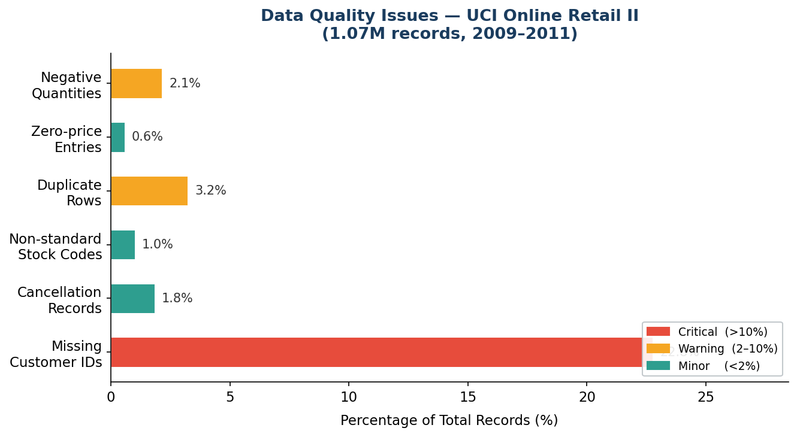
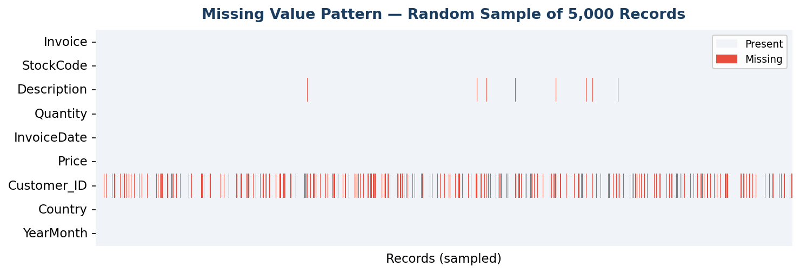
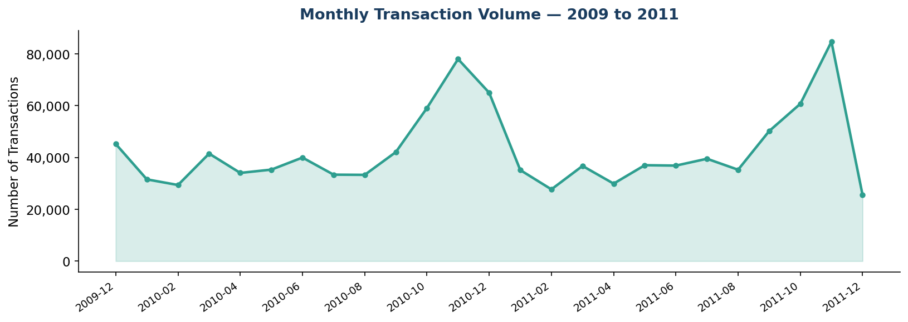
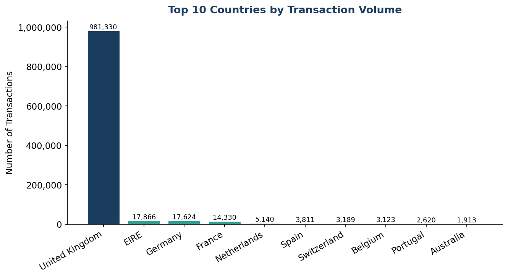

# Data Quality Assessment & Intake Specification — UCI Online Retail II

**A production-oriented data quality audit of 1,067,371 transaction records, with a proposed intake specification and validation layer for an EU industrial/pharmaceutical data-integration pipeline.**

Prepared by **Ahmed Maala** · Data Integration application · PRYZM Solutions GmbH, Germany

---

## The Question

Raw transactional data arriving from clients is rarely clean. Before it reaches a warehouse, someone has to answer three things:

1. **How bad is it, exactly?** (measured, not guessed)
2. **What does that cost the business?** (in euros, not in percentages)
3. **What contract stops it at the door next time?** (an intake spec, not a cleanup script)

This project answers all three on a public dataset that structurally mirrors the data a pharma/industrial integrator actually receives.

---

## Dataset

| | |
|---|---|
| **Source** | [UCI Online Retail II](https://archive.ics.uci.edu/dataset/502/online+retail+ii) |
| **Records** | 1,067,371 transactions |
| **Period** | December 2009 – December 2011 |
| **Geography** | 92% United Kingdom; Germany 3rd-largest market |

---

## Key Findings

| Issue | Records | % of Total | Severity |
|---|---:|---:|---|
| Missing Customer IDs | 243,007 | **22.77%** | 🔴 Critical |
| Exact duplicate rows | 34,335 | 3.22% | 🟠 Warning |
| Negative quantities | 22,950 | 2.15% | 🟠 Warning |
| Cancellation records (invoice prefix `C`) | 19,494 | 1.83% | 🟢 Minor |
| Non-standard stock codes (`POST`, `DOT`, `BANK CHARGES`) | 10,739 | 1.01% | 🟢 Minor |
| Zero-price entries | 6,202 | 0.58% | 🟢 Minor |
| Negative prices | 5 | <0.01% | 🟢 Minor |
| Missing `Description` | 4,382 | 0.41% | 🟢 Minor |


*Figure 1 — Quality issues ranked by severity. Red = Critical (>10%), Amber = Warning (2–10%), Teal = Minor (<2%).*


*Figure 2 — Missing-value pattern across a random sample of 5,000 records. The dense band on `Customer_ID` confirms the gap is systemic, not sporadic.*

---

## Quantified Business Impact

**Attribution gap.** With 22.8% of records lacking a customer identifier, customer lifetime value, cohort tracking, and churn prediction are all impossible. For a mid-size manufacturing client processing **€50M/year** in transactional data, an analogous attribution gap typically translates to a 5–8% reduction in marketing & retention ROI — roughly **€2.5M–€4M in unrealized value annually**.

**Phantom revenue.** Cancellations are co-mingled with standard sales, inflating gross revenue by ~1.8%. On a **€100M** revenue book, that is **€1.8M of phantom revenue** appearing in finance dashboards — a material misstatement.

---

## Temporal & Geographic Structure


*Figure 3 — Monthly transaction volume. Q4 peaks are consistent across both years.*


*Figure 4 — Top 10 countries by volume. UK dominates at 92%; Germany ranks third.*

---

## Why a Retail Dataset Maps onto Pharma & Industrial Data

The failure modes are not domain-specific — they are the signature of **high-volume transactional data with weak source-system controls**.

| Online Retail (this dataset) | Pharma / Industrial equivalent |
|---|---|
| Cancellation invoices (`C` prefix) | Rejected production batches / deviation reports |
| Missing Customer IDs (22.8%) | Missing plant / site / batch identifiers |
| Non-standard StockCodes (`POST`) | Non-GMN material codes across legacy ERPs |
| Negative quantities | Out-of-spec measurements / inventory returns |
| Q4 seasonal peaks | Campaign-based production cycles |
| Duplicate rows (3.2%) | Re-submitted IoT sensor readings |
| UK-dominant geography (92%) | Site-dominant plant data (lead-facility skew) |

**The implication:** the validation checks below are domain-agnostic. The same *Null Rate Guard* that catches missing Customer IDs in retail catches missing Batch IDs in pharma manufacturing.

---

## Proposed Intake Specification

### Required fields

| Field | Type | Requirement | Validation Rule |
|---|---|---|---|
| `InvoiceNo` | String(20) | Mandatory | No spaces; prefix `C` reserved for returns |
| `StockCode` | String(15) | Mandatory | Pattern `^\d{5}[A-Z]?$` |
| `Description` | String(255) | Optional | Free text; UTF-8 |
| `Quantity` | Integer | Mandatory | Must be ≠ 0; negative = return |
| `InvoiceDate` | Datetime | Mandatory | ISO 8601 `YYYY-MM-DD HH:MM:SS` |
| `UnitPrice` | Decimal(10,2) | Mandatory | Must be ≥ 0 |
| `CustomerID` | String(20) | Mandatory | Non-null; pseudonymized at ingest |
| `Country` | String | Optional | ISO 3166-1 alpha-2 preferred |

### Automated pre-ingestion checks

| # | Check | Logic | Action on Failure |
|---|---|---|---|
| 1 | Null Rate Guard | `CustomerID` null rate > 5% | Reject batch; notify client |
| 2 | Type Enforcement | `Quantity` not int OR `UnitPrice` not numeric | Reject affected rows |
| 3 | Price Sanity | `UnitPrice < 0` | Flag & quarantine row |
| 4 | Duplicate Removal | Exact row-level duplicate | Drop silently; log count |
| 5 | Return Separation | `Quantity < 0` OR invoice prefix `C` | Route to `returns_fact` |
| 6 | StockCode Pattern | Does not match `^\d{5}[A-Z]?$` | Flag as operational code |

---

## GDPR / DSGVO Compliance Layer

The intake layer is the **first compliance checkpoint**, not just a data-quality one.

| Principle | Intake-Layer Implementation |
|---|---|
| **Data Minimization** (Art. 5(1)(c)) | Only fields in the intake spec are stored; unrecognized columns logged and discarded at staging |
| **Pseudonymization** (Art. 32) | Direct identifiers replaced with deterministic surrogate keys via SHA-256 + client-specific salt at ingest |
| **Special Category** (Art. 9) | Health-related fields flagged `category=health`; elevated retention and access controls |
| **Lawful Basis** (Art. 6) | Legal basis documented per client before any data flow is enabled |
| **Storage Limitation** (Art. 5(1)(e)) | Client-specific retention; raw files purged on schedule, audit logs retained per GxP |

---

## Top Priority Improvement — Returns & Cancellations Separation Protocol

**The problem.** Returns (negative quantities) and cancellations (`C` prefix) are co-mingled with standard sales. This single issue cascades into four downstream failures: gross revenue is overstated, inventory levels are wrong, purchase frequency is inflated, and any ML model trained on this data learns from corrupted signals.

**The solution.** A two-table architecture at the staging layer — `sales_fact` (clean, positive-quantity transactions) and `returns_fact` (all negative-quantity and cancellation records). A reconciliation step aggregates absolute return quantities per `(CustomerID, StockCode)` pair, then left-joins onto the sales fact to compute `NetQty = Quantity − ReturnQty`. This avoids many-to-many joins and produces an auditable reconciliation trail.

```python
# Step 1 — Separate clean sales from returns/cancellations
sales_mask   = (df["Quantity"] > 0) & (~df["Invoice"].astype(str).str.startswith("C"))
returns_mask = (df["Quantity"] < 0) | ( df["Invoice"].astype(str).str.startswith("C"))

df_sales   = df[sales_mask].copy()
df_returns = df[returns_mask].copy()

# Step 2 — Aggregate returns per (Customer, Product) to avoid join explosion
returns_agg = (df_returns
    .assign(ReturnQty=lambda x: x["Quantity"].abs())
    .groupby(["CustomerID", "StockCode"], as_index=False)
    .agg(ReturnQty=("ReturnQty", "sum"))
)

# Step 3 — Compute net quantity per sale
df_net = (df_sales
    .merge(returns_agg, on=["CustomerID", "StockCode"], how="left")
    .assign(
        ReturnQty = lambda x: x["ReturnQty"].fillna(0),
        NetQty    = lambda x: x["Quantity"] - x["ReturnQty"],
    )
)
```

**Forward-looking enhancement — data lineage.** For pharmaceutical clients, the pipeline tags every record with `source_batch_id` and `ingestion_timestamp`, enabling one-click traceability from a dashboard KPI back to the raw source file — aligning with **ALCOA+** data-integrity principles required under GxP.

---

## Repository Contents

```
.
├── 01_analysis.py                          # Data quality analysis pipeline
├── 02_generate_pdf.py                      # Report generation
├── outputs/
│   ├── fig1_quality_overview.png
│   ├── fig2_monthly_volume.png
│   ├── fig3_top_countries.png
│   └── fig4_missing_heatmap.png
└── PRYZM_DataQuality_AhmedMaala_MERGED.pdf # Full 5-page report
```

## Reproduce

```bash
git clone https://github.com/ahmed4maala-afk/Data-Integration-Internship-Project.git
cd Data-Integration-Internship-Project
pip install pandas numpy matplotlib seaborn
python 01_analysis.py
```

**Stack:** Python 3.11 · pandas · NumPy · matplotlib · seaborn

---

## Author

**Ahmed Maala** — Analytics Engineer (Liora × Sorbonne)
📧 ahmed4maala@gmail.com · [GitHub](https://github.com/ahmed4maala-afk) · [LinkedIn](https://linkedin.com/in/ahmed-maala-b854b0390)
